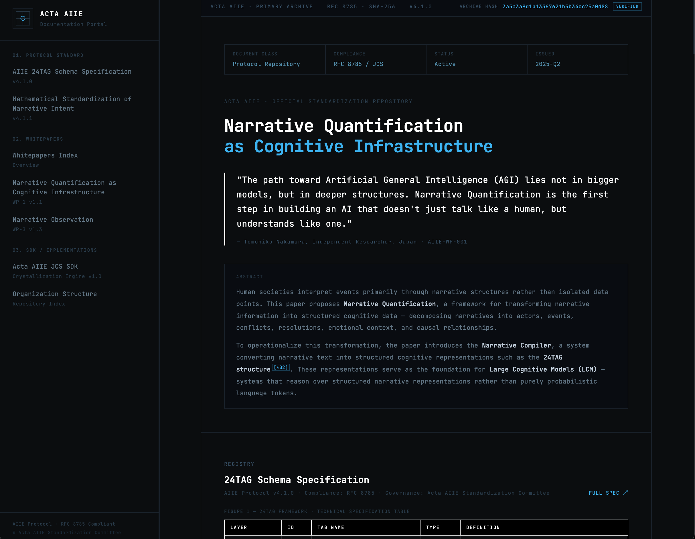

[](https://acta-aiie.org/)

# HEXT-AI / hxt-spec

HEXT-AI builds protocol infrastructure for narrative integrity: formats, schemas, and reference implementations that make human and AI collaboration more inspectable, verifiable, and durable.

> "The path toward Artificial General Intelligence (AGI) lies not in bigger models, but in deeper structures. Narrative Quantification is the first step in building an AI that doesn't just talk like a human, but understands like one."
>
> — [Narrative Quantification as Cognitive Infrastructure](https://acta-aiie.org/)

`hxt-spec` is the technical repository for the `.hxt` format, a Markdown-native protocol for preserving provenance without sacrificing readability. It keeps the document human-readable while appending a machine-verifiable ledger between `<!--hxt:begin-->` and `<!--hxt:end-->`. The ledger stores timestamps, edit deltas, and hashes only. It never duplicates the document body.

## HEXT Protocol and 24TAG Schema

The relationship between `HEXT` and `24TAG Schema` is architectural.

- `24TAG Schema` defines the cognitive structure of a narrative state: actors, events, causal links, conflict, tone, and closure in a canonical form.
- `HEXT Protocol` defines how those structured states, and the documents derived from them, are carried, sealed, versioned, and verified in practical workflows.
- Together they connect semantic interpretation to cryptographic accountability: `24TAG` provides the schema of meaning, while `HEXT` provides the document and integrity layer that preserves provenance across revisions, systems, and collaborators.

In that sense, `24TAG` is the schema for computable narrative cognition, and `HEXT` is the protocol surface that lets those cognitive states move through real documentation environments with trust intact.

## What This Repository Contains

This repository contains the open specification and reference implementations for `.hxt`.

- `SPEC.md`: Technical specification for the `.hxt` format
- `hxt.js`: Reference implementation for Node.js and browsers
- `hxt.py`: Reference implementation for Python, including a CLI
- `examples/sample.hxt`: Valid sample document
- `examples/invalid.hxt`: Tampered sample document that should fail verification

## Quick Start

Verify the bundled examples:

```bash
python3 hxt.py verify examples/sample.hxt
python3 hxt.py verify examples/invalid.hxt
python3 hxt.py summary examples/sample.hxt
```

Use the Python API:

```python
from hxt import crystallize, verify

body = "# Demo\n\nHuman reviewed text."
file_content = crystallize(body, author_type="HUMAN")
print(verify(file_content))
```

Use the JavaScript API in Node.js:

```js
const { crystallize, verify } = require("./hxt.js");

async function main() {
  const body = "# Demo\n\nHuman reviewed text.";
  const fileContent = await crystallize(body, "HUMAN");
  console.log(await verify(fileContent));
}

main();
```

Use the JavaScript API in a browser:

```html
<script src="./hxt.js"></script>
<script>
  HXT.crystallize("# Demo\n\nHuman reviewed text.", "HUMAN").then(console.log);
</script>
```

## Explore Further

- Official portal: [acta-aiie.org](https://acta-aiie.org/)
- 24TAG Schema: [acta-aiie.org/protocol/24tag-schema](https://acta-aiie.org/protocol/24tag-schema)
- HEXT specification repository: [HEXT-AI/hxt-spec](https://github.com/HEXT-AI/hxt-spec)

## License

MIT © Gemmina Intelligence LLC
